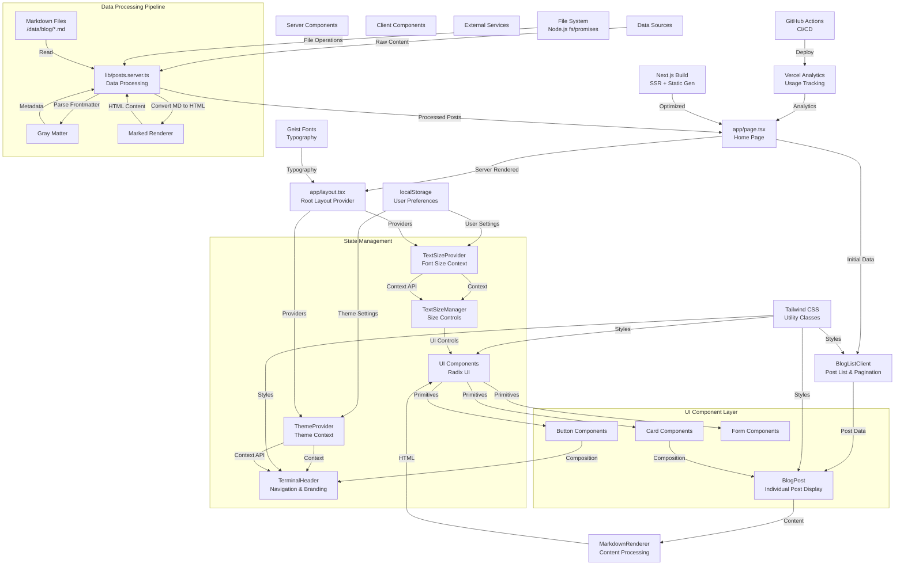

## Technology Overview & Architecture Analysis

### Core Technology Stack

**Frontend Framework & Runtime:**
- **Next.js 14** - React framework with App Router for server-side rendering and file-based routing
- **React 18** - UI library with concurrent features and hooks
- **TypeScript** - Type-safe JavaScript for better development experience

**Styling & UI:**
- **Tailwind CSS** - Utility-first CSS framework for rapid UI development
- **Radix UI** - Headless component library providing 20+ accessible components
- **Geist Font** - Modern typography system (Sans & Mono variants)
- **Tailwind Typography** - Plugin for beautiful markdown rendering

**State Management:**
- **React Context** - Custom providers for text size and theme management
- **next-themes** - Theme switching functionality (light/dark mode)
- **localStorage** - Persistent storage for user preferences

**Data Processing:**
- **Gray Matter** - Frontmatter parsing for markdown files
- **Marked** - Markdown to HTML conversion with custom renderer
- **Remark** - Additional markdown processing utilities

**Development & Build Tools:**
- **PostCSS & Autoprefixer** - CSS processing and vendor prefixing
- **ESLint** - Code linting and quality assurance
- **GitHub Actions** - CI/CD pipeline for automated deployment

### Architecture Diagram

### Key Dependencies & Data Flow

**Data Sources → Processing Pipeline:**
1. **Markdown Files** (`/data/blog/*.md`) contain blog posts with frontmatter metadata
2. **File System** operations read these files using Node.js `fs/promises`
3. **Gray Matter** parses frontmatter (title, date, author, tags, excerpt)
4. **Marked** converts markdown content to HTML with custom renderer
5. **Posts Library** (`lib/posts.server.ts`) orchestrates the entire data processing pipeline

**Server-Side Rendering Flow:**
1. **Page Component** (`app/page.tsx`) fetches posts using `getBlogPosts()`
2. **Server Components** render initial HTML with post data
3. **Client Components** hydrate for interactivity (blog list, theme switching)

**State Management Architecture:**
1. **TextSizeProvider** manages font size preferences via React Context
2. **ThemeProvider** handles light/dark theme switching
3. **localStorage** persists user preferences across sessions
4. **Context Consumers** throughout the app access and update these states

**UI Component Architecture:**
1. **Radix UI** provides headless, accessible component primitives
2. **Custom Components** compose these primitives with Tailwind styling
3. **Terminal-themed Design** creates a unique developer-focused aesthetic

**Build & Deployment:**
1. **Next.js** handles SSR, static generation, and optimization
2. **GitHub Actions** automates build and deployment to Vercel
3. **Vercel Analytics** provides usage statistics